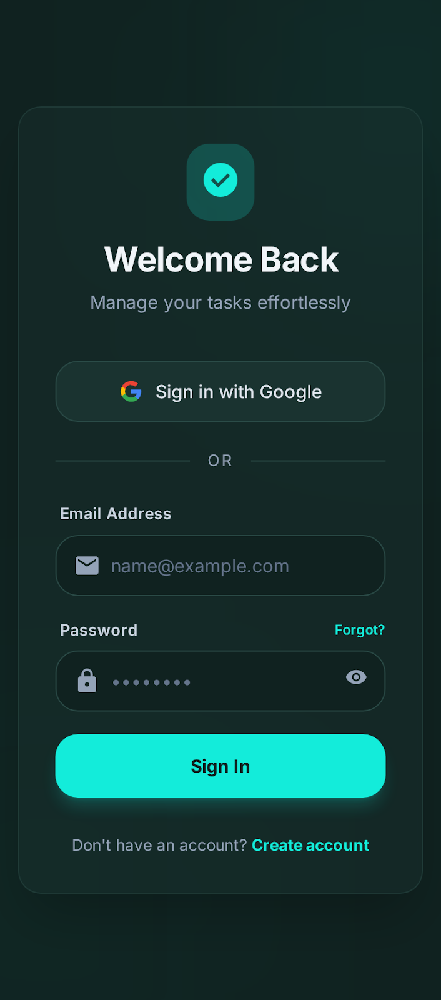
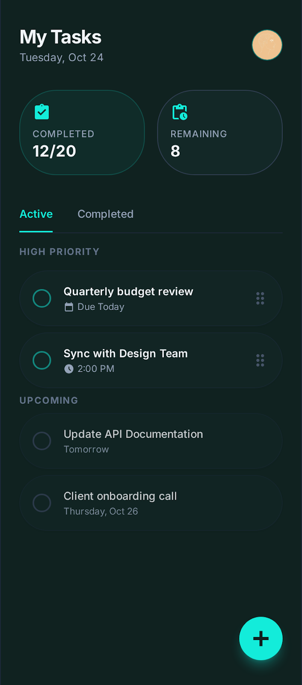
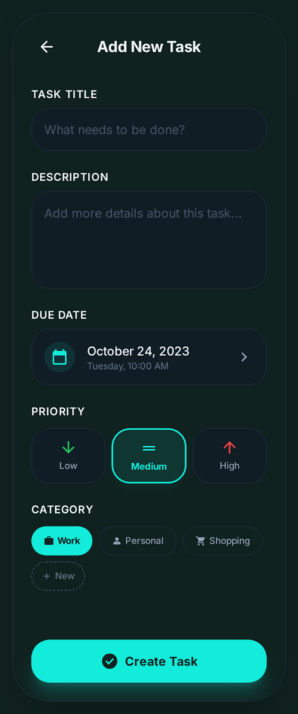
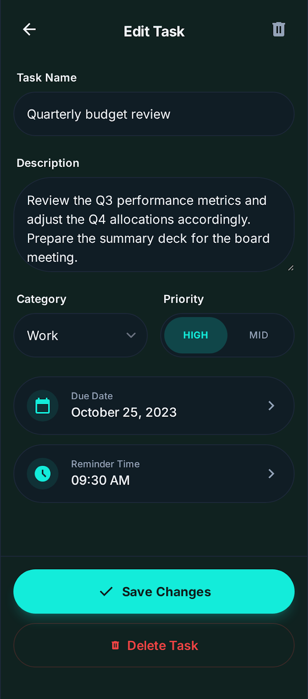

# Todo App 26

A modern, feature-rich To-Do application built with Flutter and Firebase. This app features a sleek, premium dark-themed UI with glassmorphism elements, offering a seamless task management experience.

## ✨ Features

- **Authentication**: Secure login with Google Sign-In and Email/Password.
- **Task Management**: Create, edit, and delete tasks with ease.
- **Task Categorization**: Organize tasks into categories like Work, Personal, and Shopping.
- **Prioritization**: Assign priority levels (High, Medium, Low) to stay focused on what matters.
- **Due Dates & Scheduling**: Set due dates and reminder times for tasks.
- **Interactive UI**: Fluid animations and a modern aesthetic for a premium experience.
- **Dark Mode**: Optimized for comfortable use in all lighting conditions.

## 📱 Screenshots

<div align="center">
  <table style="width: 100%; border-collapse: collapse;">
    <tr>
      <td align="center" style="width: 50%;">
        <p><strong>Login Screen</strong></p>
        
      </td>
      <td align="center" style="width: 50%;">
        <p><strong>Task List (Home)</strong></p>
        
      </td>
    </tr>
    <tr>
      <td align="center" style="width: 50%;">
        <p><strong>Create New Task</strong></p>
        
      </td>
      <td align="center" style="width: 50%;">
        <p><strong>Edit Existing Task</strong></p>
        
      </td>
    </tr>
  </table>
</div>

## 🚀 Tech Stack

- **Framework**: [Flutter](https://flutter.dev)
- **State Management**: [Flutter BLoC](https://pub.dev/packages/flutter_bloc)
- **Backend**: [Firebase Core](https://firebase.google.com/docs/flutter/setup)
- **Authentication**: [Firebase Auth](https://firebase.google.com/docs/auth/flutter/start) & [Google Sign In](https://pub.dev/packages/google_sign_in)
- **Data Persistence**: [Flutter Dotenv](https://pub.dev/packages/flutter_dotenv)

## 🛠️ Getting Started

### Prerequisites

- Flutter SDK (latest version)
- Android Studio or VS Code
- Firebase Project configured for Android and iOS

### Installation

1. **Clone the repository**:
   ```bash
   git clone https://github.com/Sukendh/todo_app26.git
   cd todo_app26
   ```

2. **Install dependencies**:
   ```bash
   flutter pub get
   ```

3. **Configure Firebase**:
   - Ensure `google-services.json` is in `android/app/`.
   - Ensure `GoogleService-Info.plist` is in `ios/Runner/`.

4. **Environment Variables**:
   - Create a `.env` file in the root directory if needed for API keys.

5. **Run the app**:
   ```bash
   flutter run
   ```

## 📄 License

Distributed under the MIT License. See `LICENSE` for more information.
